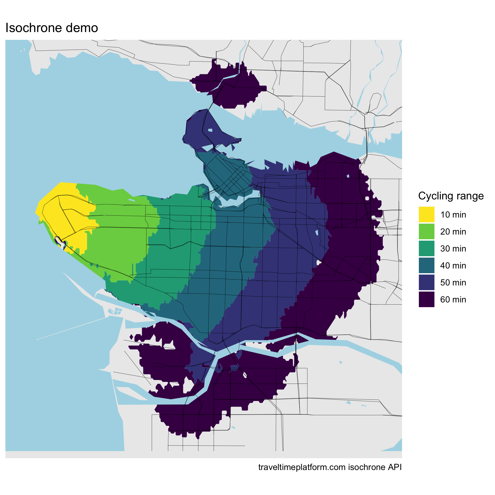
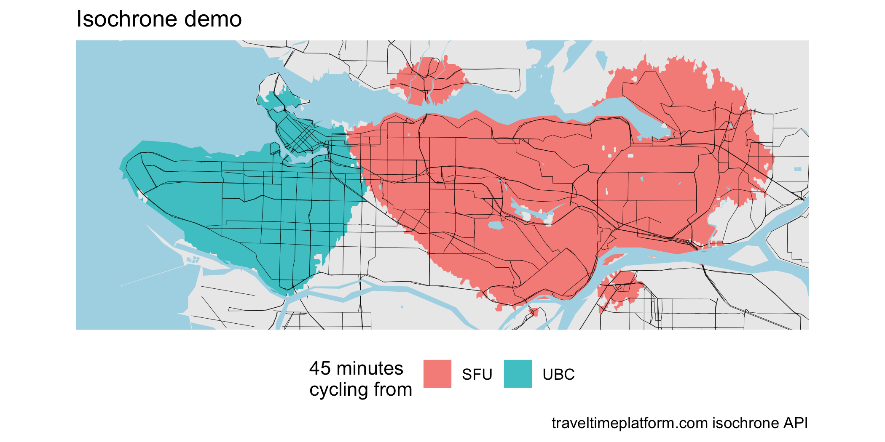

# rtraveltime
R bindings to the traveltimeplatform.com isochrone API

A very rudimetary package to generate travel time isochrones.
## Stacked isochrones cycling from UBC

## 45 minute cycling ranges from UCB vs SFU

